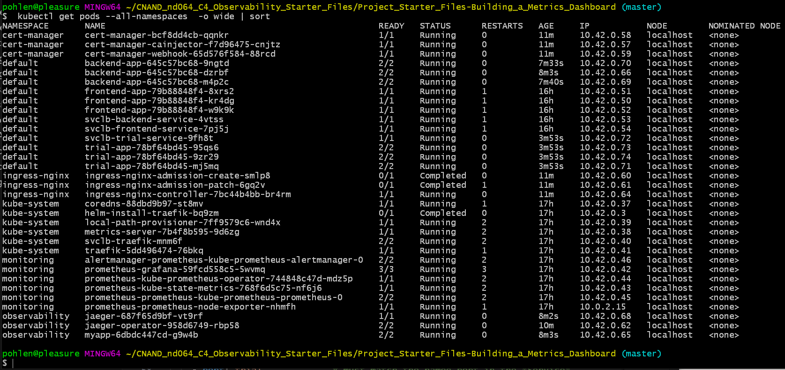
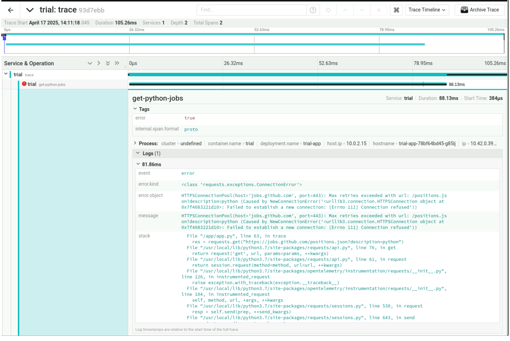

**Note:** For the screenshots, you can store all of your answer images in the `answer-img` directory.

## 1. Verify the monitoring installation

run `kubectl` command to show the running pods and services for all components. Take a screenshot of the output and include it here to verify the installation.

## 2. Setup the Jaeger and Prometheus source
Expose Grafana to the internet and then setup Prometheus as a data source. Provide a screenshot of the home page after logging into Grafana.

## 3. Create a Basic Dashboard
Create a dashboard in Grafana that shows Prometheus as a source. Take a screenshot and include it here.

## 4. Describe SLO/SLI
Describe, in your own words, what the SLIs are, based on an SLO of *monthly uptime* and *request response time*.

- The Service-Level Objective *monthly uptime* is the customer-centric and measurable goal e.g.(monthly uptime = 95%). With the Service-Level Indicator *uptime* (actually measured) we can than see, if we reached the goal at every end of the month.

- The Service-Level Objective *request response time* is the customer-centric and measurable goal e.g.(request response time < 400ms). With the Service-Level Indicator *response time* (actually measured) we can than see, if we reached the goal for every request.

## 5. Creating SLI metrics.
It is important to know why we want to measure certain metrics for our customer. Describe in detail 5 metrics to measure these SLIs. 

- Latency – Measures the time taken for a system to respond to a request. Lower latency indicates faster response times, which is crucial for user experience.

- Availability – Represents the percentage of time a service is operational and accessible. High availability ensures minimal downtime and better reliability.

- Error Rate – Tracks the proportion of failed requests compared to total requests. A lower error rate signifies a more stable and dependable system.

- Throughput – Measures the number of successful transactions or requests processed per unit of time. Higher throughput indicates better system efficiency.

- Durability – Relevant for storage systems, durability ensures that data remains intact and retrievable over time, preventing loss or corruption.

## 6. Create a Dashboard to measure our SLIs
*TODO:* Create a dashboard to measure the uptime of the frontend and backend services We will also want to measure to measure 40x and 50x errors. Create a dashboard that show these values over a 24 hour period and take a screenshot.

## 7. Tracing our Flask App
*TODO:*  We will create a Jaeger span to measure the processes on the backend. Once you fill in the span, provide a screenshot of it here. Also provide a (screenshot) sample Python file containing a trace and span code used to perform Jaeger traces on the backend service.

## 8. Jaeger in Dashboards
*TODO:* Now that the trace is running, let's add the metric to our current Grafana dashboard. Once this is completed, provide a screenshot of it here.

## 9. Report Error
*TODO:* Using the template below, write a trouble ticket for the developers, to explain the errors that you are seeing (400, 500, latency) and to let them know the file that is causing the issue also include a screenshot of the tracer span to demonstrate how we can user a tracer to locate errors easily.

TROUBLE TICKET

Name: Frank Pohlen

Date: 17.4.2025

Subject: trial app

Affected Area: Homepage "/"

Severity: high (no function at all)

Description: accessing the trial app (localhost:8082) leads to an "Internal Server Error" (500). Accessing a trace (localhost:8082/trace) shows an error Log in jaeger (see picture). The error is located in referenced-app/trial/app.py. A link ""https://jobs.github.com/positions.json?description=python" does not work.

## 10. Creating SLIs and SLOs
*TODO:* We want to create an SLO guaranteeing that our application has a 99.95% uptime per month. Name four SLIs that you would use to measure the success of this SLO.

Latency, Availability, Error Rate and Throughput.

## 11. Building KPIs for our plan
*TODO*: Now that we have our SLIs and SLOs, create a list of 2-3 KPIs to accurately measure these metrics as well as a description of why those KPIs were chosen. We will make a dashboard for this, but first write them down here.

Latency
This will define a responstime where the customer is not satisfyied and therefore counts as "not up".

Availability
This is the uptime for the application. The time this application is accessible.

Error Rate
Here we can define a max error rate to also define when the application is "not up"

## 12. Final Dashboard
*TODO*: Create a Dashboard containing graphs that capture all the metrics of your KPIs and adequately representing your SLIs and SLOs. Include a screenshot of the dashboard here, and write a text description of what graphs are represented in the dashboard. 

### average latency off all flask http requests
shows the latency of all parts of the application with tresholds to easy find the problematic times.

### uptime of frontend-, backend- and trial-app
shows the uptime in % for all parts of the application

### flask http error rate
shows the overall error rate of all flask http requests for all parts of the application 
